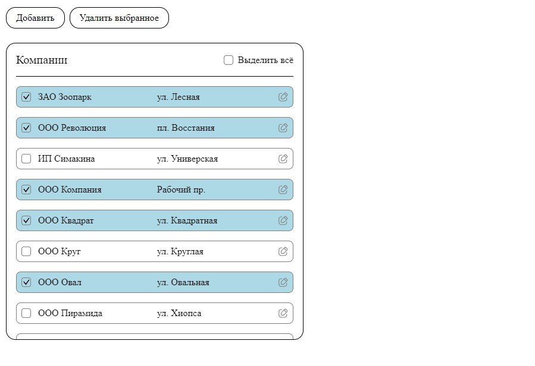

# Тестовое задание на должность "Frontend-разработчик"

Стек:
- react
- redux(redux-toolkit)
- typescript
- Остальное на усмотрение, НО стоит использовать минимальное кол-во библиотек(например, таблицу нужно точно сделать самостоятельно, без сторонних библиотек)

Дано:
- Имеется таблица со списком компаний
- Данные в таблице должны храниться в сторе
- Данные для таблицы - фейковые, создать самостоятельно
- Шапка таблицы "компании": Чекбокс “Выделить всё”
- Тело таблицы имеет столбцы: | Чекбокс | Название компании  | Адрес
- При клике по чекбоксу в строке, соответствующая строка выделяется цветом на усмотрение
- При клике по чекбоксу “Выделить всё” - выделяются все строки.
- Все поля таблицы редактируемые.
- В таблице реализовать механизм добавления/удаления компаний по соответствующим кнопкам.
- Удаление может быть множественное(если выделены несколько строк).

Будет плюсом:
- предусмотреть вариант когда компаний может быть 10 000+ (желательно предложить вариант без переключения по страницам, динамическая загрузка при скролле)

Примечания:  
- Желательно использовать минимум сторонних библиотек.  
- Дизайн приложения на ваш вкус. 
- Выполнение всех пунктов не является обязательным, но желательным.

***Все поставленные задачи были выполнены!***

Рабочая версия приложение находится по ссылке: [Test task](https://test-task-a.vercel.app/)

